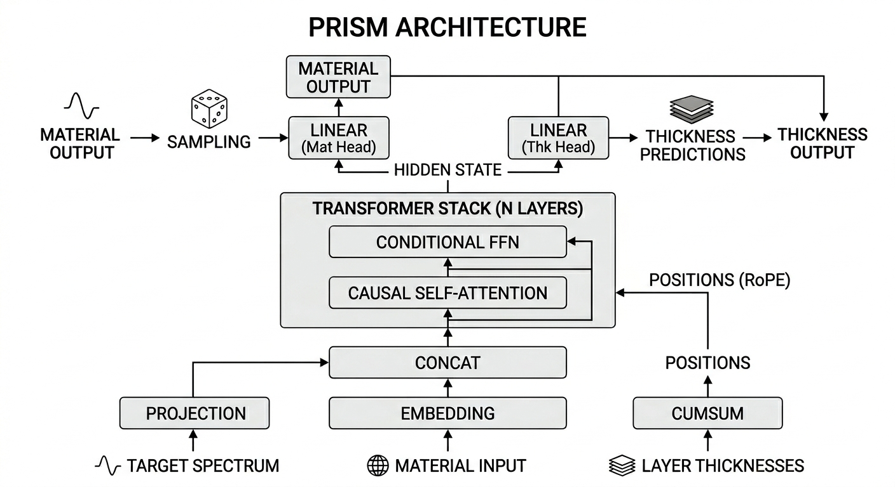

# PRISM -- Position-encoded Regressive Inverse Spectral Model

PRISM is an autoregressive transformer for **inverse thin-film optical design**: given a target optical spectrum, generate a multilayer thin-film stack (materials and thicknesses) whose physical response matches it. The model decodes layer-by-layer, jointly predicting each layer's material and thickness until it terminates, then the predicted structure is verified via Transfer Matrix Method (TMM) simulation.

You can play with an interactive version of the model [here](https://www.prism-playground.com/).

Three architectural ideas distinguish PRISM from prior sequence-to-sequence approaches like [OptoGPT](https://github.com/taigaoma1997/optogpt):

1. **Spectrum prefix conditioning** -- the target spectrum is projected into a single learned token and prepended to the decoder sequence, replacing cross-attention with simpler causal self-attention.
2. **Cumulative-depth RoPE** -- instead of encoding sequential token index, Rotary Position Embeddings use the running cumulative physical depth (nm) of the film stack, giving the model an explicit sense of optical path length.
3. **Per-material thickness head** -- a multi-layer MLP predicts a thickness for *every* material in the vocabulary at each position, enabling beam search to jointly score (material, thickness) pairs without committing to a material first.

Thickness is treated as a **continuous regression target** (nm), not a discretised token.

---

## Key Results

Evaluated on 10,000 validation samples with TMM re-simulation (greedy and beam-search decoding). MAE is computed over the full 142-dimensional spectrum vector (71 R + 71 T, values in [0, 1]):

| Condition | Greedy MAE | Oracle MAE | Notes |
|---|---|---|---|
| In-distribution (10 nm steps, 1-20 layers) | 0.0272 | **0.0238** | |
| OOD: 5 nm thickness steps | 0.0308 | 0.0270 | Finer granularity than training |
| OOD: 20-30 layers | 0.0278 | 0.0250 | 1.5x longer sequences |
| OOD: 40-50 layers | 0.0280 | 0.0252 | 2.5x longer sequences |
| OOD: cum. depth up to 18,000 nm | 0.0275 | 0.0243 | 1.8x deeper than training max |

The model generalises to out-of-distribution sequence lengths and thickness ranges by learning to **compress** designs: it maps long, deep ground-truth stacks into shorter, shallower approximations that preserve spectral fidelity. See [`reports/13m_model_evaluation.md`](reports/13m_model_evaluation.md) for the full evaluation.

---

## Architecture



### Spectrum prefix conditioning

The target spectrum (reflectance + transmittance) is projected through a linear layer into a single token prepended to the decoder sequence. The entire model uses **causal self-attention only** -- no encoder, no cross-attention. The spectrum prefix attends to itself; all subsequent tokens attend to the prefix and to previous tokens. This is simpler than encoder-decoder designs and makes the conditioning always visible in the attention window.

### Cumulative-depth RoPE

Standard RoPE encodes sequential position (0, 1, 2, ...). PRISM replaces this with the cumulative physical depth of the film stack: `positions = [0, cumsum(thicknesses)]`. The spectrum prefix sits at position 0; each layer token sits at the total depth up to that layer.

This gives the attention mechanism a physically meaningful distance metric -- two layers separated by a large gap of material interact differently than two layers in close proximity, even if they are adjacent in token index. The position encoding directly reflects optical path length, which governs thin-film interference.

### Dual output heads

A single shared transformer backbone feeds two output heads:

- **Material head**: linear projection to logits over the material vocabulary.
- **Thickness head**: a multi-layer MLP producing one thickness prediction *per material* at each position. When a material is selected, the corresponding thickness prediction is used.

The per-material thickness head is the key enabler for joint beam search. Each beam candidate can evaluate every (material, thickness) pair at every step without a two-stage decode.

### Training

- **Material loss**: label-smoothed KL divergence
- **Thickness loss**: masked MSE in log-space
- **LR schedule**: cosine annealing with linear warmup

See [`CLAUDE.md`](CLAUDE.md) for default hyperparameters and training configuration details.

---

## Getting Started
Pre-generated validation datasets are available on Hugging Face: [HenryWang4/PRISM](https://huggingface.co/datasets/HenryWang4/PRISM). 

A pre-trained model checkpoint is also available: [HenryWang4/PRISM](https://huggingface.co/HenryWang4/PRISM).

### Install

```bash
uv sync
# or
pip install -e .
```

Requires Python 3.10+. The `nk/` directory contains per-material refractive index CSV files and must be present for data generation and evaluation.

### Generate data

```bash
python generate_data.py --n_samples 3000000
```

Outputs partitioned Arrow files into `data/train/`, `data/dev/`, `data/val/`. Running again auto-increments the partition number. Pass `--seed 42` for reproducibility.

### Train

```bash
python train_inverse.py \
    --train_path ./data/train --dev_path ./data/dev \
    --d_model 256 --n_layers 4 --n_heads 4 \
    --epochs 30 --batch_size 1024 --run_name inverse_v1
```

Checkpoints are saved to `saved_models/inverse/{run_name}/` as `best.pt` (lowest dev loss) and `latest.pt` (every epoch).

### Evaluate

```bash
python evaluate.py \
    --checkpoint saved_models/inverse/inverse_v1/best.pt \
    --val_path ./data/val/part_000.arrow \
    --nk_dir ./nk --n_samples 1000 \
    --beam_width 5 --length_penalty 0.3 \
    --plot_dir ./plots/inverse_eval
```

Decodes structures (greedy or beam search), re-simulates via TMM, and compares against target spectra. Also evaluates hand-crafted target spectra (bandpass, shortpass, etc.) with top-K beam candidates.

---

## Project Structure

```
prism/
  data/
    sim.py              # TMM simulation, material nk loading, cubic-spline interpolation
    dataset.py           # Vocab, Batch, ThinFilmDataset, make_dataloader
  model/
    common.py            # MultiHeadAttention (RoPE-aware), FeedForward, ResidualConnection
    prefix_material_thk_model.py  # Active architecture (described above)
    transformer.py       # Re-exports InverseModel
  training/
    train.py             # LR schedule, LabelSmoothing, train_inverse
  eval/
    metrics.py           # SpectrumMetrics (MSE, MAE, R^2)
    decode.py            # Greedy + beam search decoding
    visualize.py         # Matplotlib figure helpers
    targets.py           # Hand-crafted target spectra registry
generate_data.py         # CLI: sample + simulate training data
train_inverse.py         # CLI: train InverseModel
evaluate.py              # CLI: evaluate a checkpoint
nk/                      # Per-material n,k CSV files (42 materials)
```

---

## Thin Film Design Space

| Parameter | Range |
|---|---|
| Materials | 17 dielectrics/metals + Glass substrate |
| Thickness per layer | 10-500 nm, 10 nm steps |
| Layers per stack | 1-20 |
| Wavelength range | 400-1100 nm (71 points, 10 nm steps) |
| Spectrum | 142 floats (71 reflectance + 71 transmittance) |

---

## Proof-of-Concept Model Details

The current implementation uses a small model to validate the architecture. Production deployments may use different sizes.

### Hyperparameters

| Parameter | Value |
|---|---|
| `d_model` | 512 |
| `d_ff` | 2048 |
| `n_heads` | 4 |
| `n_layers` | 4 |
| `dropout` | 0.1 |
| `thk_head_hidden_layers` | 2 |
| **Total parameters** | ~13M |

### Training configuration

- **Material loss**: label-smoothed KL divergence (smoothing=0.1)
- **Thickness loss**: masked MSE in log-space, scaled by `thk_loss_weight=1.0`
- **LR schedule**: cosine annealing with linear warmup (peak 3e-4, 4000 warmup steps, min 3e-7)

### OOD generalisation

The model learns to **compress** designs, mapping long/deep ground-truth stacks into shorter (~10-12 layer), shallower (~2,000-3,300 nm) approximations that preserve spectral fidelity. Compression ratio scales from 1.35x (in-distribution) to 4.8x (50-layer inputs) with minimal quality loss.
